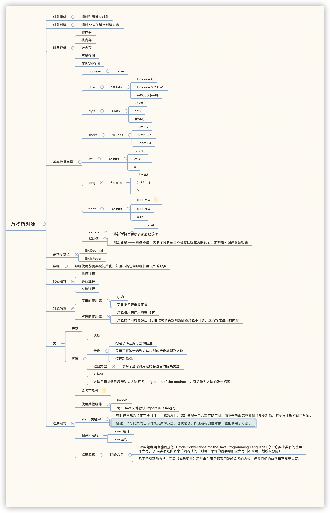

# 万物皆对象



## 对象操作

Java中通过对象的引用来操作一个Java对象

## 对象创建

“引用”用来关联"对象"。在Java中，通常我们使用**new**操作符来创建一个新对象。

### 数据存储

程序运行时，有5个不同的地方可以存储数据:

> 1. **寄存器** (Registers) 最快的存储区域，位于CPU内部。然而，寄存器的数量十分有限，所以寄存器根据需求进行分配。我们对其没有直接的控制权，也无法在自己的程序里找到寄存器存在的踪迹（另一方面，C/C++ 允许开发者向编译器建议寄存器的分配）
> 2. **栈内存**（Stack）存在于常规内存 RAM（随机访问存储器，Random Access Memory）区域中，可通过栈指针获得处理器的直接支持。栈指针下移分配内存，上移释放内存，这是一种快速有效的内存分配方法，速度仅次于寄存器。创建程序时，Java 系统必须准确地知道栈内保存的所有项的生命周期。这种约束限制了程序的灵活性。因此，虽然在栈内存上存在一些 Java 数据，特别是对象引用，但 Java 对象却是保存在堆内存的。
> 3. **堆内存**（Heap）这是一种通用的内存池（也在 RAM 区域），所有 Java 对象都存在于其中。与栈内存不同，编译器不需要知道对象必须在堆内存上停留多长时间。因此，用堆内存保存数据更具灵活性。创建一个对象时，只需用 `new` 命令实例化对象即可，当执行代码时，会自动在堆中进行内存分配。这种灵活性是有代价的：分配和清理堆内存要比栈内存需要更多的时间（如果可以用 Java 在栈内存上创建对象，就像在 C++ 中那样的话）。随着时间的推移，Java 的堆内存分配机制现在已经非常快，因此这不是一个值得关心的问题了。
> 4. **常量存储**（Constant storage）常量值通常直接放在程序代码中，因为它们永远不会改变。如需严格保护，可考虑将它们置于只读存储器 ROM （只读存储器，Read Only Memory）中 
> 5. **非 RAM 存储**（Non-RAM storage）数据完全存在于程序之外，在程序未运行以及脱离程序控制后依然存在。两个主要的例子：（1）序列化对象：对象被转换为字节流，通常被发送到另一台机器；（2）持久化对象：对象被放置在磁盘上，即使程序终止，数据依然存在。这些存储的方式都是将对象转存于另一个介质中，并在需要时恢复成常规的、基于 RAM 的对象。Java 为轻量级持久化提供了支持。而诸如 JDBC 和 Hibernate 这些类库为使用数据库存储和检索对象信息提供了更复杂的支持。

### 基本数据类型

基本类型使用频率很高，不使用new关键字创建，保存在栈内存中，因此更高效。

Java确定了每种基本类型的内存占用大小。这些大小不会像其他一些语言那样随着机器环境的变化而变化。这种不变性也是 Java 更具可移植性的一个原因。

| 基本类型 | 大小    | 最小值    | 最大值           | 包装类型  |
| -------- | ------- | --------- | ---------------- | --------- |
| boolean  | --      | --        | --               | Boolean   |
| char     | 16 bits | Unicode 0 | Unicode 2^16 - 1 | Character |
| byte     | 8 bits  | -128      | +127             | Byte      |
| short    | 16 bits | -2^15     | +2^15 - 1        | Short     |
| int      | 32 bits | -2^31     | +2^31 - 1        | Integer   |
| long     | 64 bits | -2^63     | +2^63 - 1        | Long      |
| float    | 32 bits | IEEE754   | IEEE754          | Float     |
| double   | 64 bits | IEEE754   | IEEE754          | Double    |
| void     | --      | --        | --               | Void      |

### 高精度数值

`BigInteger`支持任意精度的整数，运算过程中不对丢失精度。

`BigDecimal`支持任意精度的定义数字。

### 数组的存储

在 Java 中，数组使用前需要被初始化，并且不能访问数组长度以外的数据。当我们创建对象数组时，实际上是创建了一个引用数组，并且每个引用的初始值都为 **null** 。在使用该数组之前，我们必须为每个引用指定一个对象 。如果我们尝试使用为 **null** 的引用，则会在运行时报错。因此，在 Java 中就防止了数组操作的常规错误。我们还可创建基本类型的数组。编译器通过将该数组的内存全部置零来保证初始化。

## 代码注释

### 单行注释

```java
// 这是单行注释	
```

### 多行注释

```java
/*
这是多行注释
这是多行注释
*/
```

### 文档注释

```java
/**
 * 这是文档注释
 *
 */
```

## 对象清理

### 作用域

大多数程序语言都有作用域的概念。作用域决定了在该范围内定义的变量名的可见性和生存周期。在 C、 C++ 和 Java 中，作用域是由大括号 `{}` 的位置决定的。例如：

```java
{
    int x = 12;
    // 仅 x 变量可用
    {
        int q = 96;
        // x 和 q 变量皆可用
    }
    // 仅 x 变量可用
    // 变量 q 不在作用域内
}
```

Java 的变量只有在其作用域内才可用。缩进使得 Java 代码更易于阅读。由于 Java 是一种自由格式的语言，额外的空格、制表符和回车并不会影响程序的执行结果。在 Java 中，你不能执行以下操作，即使这在 C 和 C++ 中是合法的：

```java
{
    int x = 12;
    {
        int x = 96; // Illegal
    }
}
```

在上例中， Java 编译器会在提示变量 x 已经被定义过了。因此，在 C/C++ 中将一个较大作用域的变量"隐藏"起来的做法，在 Java 中是不被允许的。 因为 Java 的设计者认为这样做会导致程序混乱。

### 对象的作用域

Java 对象与基本类型具有不同的生命周期。当我们使用 `new` 关键字来创建 Java 对象时，它的生命周期将会超出作用域。因此，下面这段代码示例：

```java
{
    String s = new String("a string");
} 
// 作用域终点复制ErrorOK!
```

上例中，引用 s 在作用域终点就结束了。但是，引用 s 指向的字符串对象依然还在占用内存。在这段代码中，我们无法在这个作用域之后访问这个对象，因为唯一对它的引用 s 已超出了作用域的范围。在后面的章节中，我们还会学习怎么在编程中传递和复制对象的引用。

只要你需要，`new` 出来的对象就会一直存活下去。 相比在 C++ 编码中操作内存可能会出现的诸多问题，这些困扰在 Java 中都不复存在了。在 C++ 中你不仅要确保对象的内存在你操作的范围内存在，还必须在使用完它们之后，将其销毁。

那么问题来了：我们在 Java 中并没有主动清理这些对象，那么它是如何避免 C++ 中出现的内存被填满从而阻塞程序的问题呢？答案是：Java 的垃圾收集器会检查所有 `new` 出来的对象并判断哪些不再可达，继而释放那些被占用的内存，供其他新的对象使用。也就是说，我们不必担心内存回收的问题了。你只需简单创建对象即可。当其不再被需要时，能自行被垃圾收集器释放。垃圾回收机制有效防止了因程序员忘记释放内存而造成的“内存泄漏”问题。

## 类的创建

### 类型

如果一切都是对象，那么是什么决定了某一类对象的外观和行为呢？换句话说，是什么确定了对象的类型？你可能很自然地想到 `type` 关键字。但是，事实上大多数面向对象的语言都使用 `class` 关键字类来描述一种新的对象。 通常在 `class` 关键字的后面的紧跟类的的名称。如下代码示例：

```java
class ATypeName {
 // 这里是类的内部
}复制ErrorOK!
```

在上例中，我们引入了一个新的类型，尽管这个类里只有一行注释。但是我们一样可以通过 `new` 关键字来创建一个这种类型的对象。如下：

```java
ATypeName a = new ATypeName();复制ErrorOK!
```

到现在为止，我们还不能用这个对象来做什么事（即不能向它发送任何有意义的消息），除非我们在这个类里定义一些方法。

### 字段

当我们创建好一个类之后，我们可以往类里存放两种类型的元素：方法（method）和字段（field）。类的字段可以是基本类型，也可以是引用类型。如果类的字段是对某个对象的引用，那么必须要初始化该引用将其关联到一个实际的对象上（通过之前介绍的创建对象的方法）。每个对象都有用来存储其字段的空间。通常，字段不在对象间共享。下面是一个具有某些字段的类的代码示例：

```java
class DataOnly {
    int i;
    double d;
    boolean b;
}复制ErrorOK!
```

这个类除了存储数据之外什么也不能做。但是，我们仍然可以通过下面的代码来创建它的一个对象：

```java
    DataOnly data = new DataOnly();复制ErrorOK!
```

我们必须通过这个对象的引用来指定字段值。格式：对象名称.方法名称或字段名称。代码示例：

```java
    data.i = 47;
    data.d = 1.1;
    data.b = false;复制ErrorOK!
```

如果你想修改对象内部包含的另一个对象的数据，可以通过这样的格式修改。代码示例：

```java
    myPlane.leftTank.capacity = 100;复制ErrorOK!
```

你可以用这种方式嵌套许多对象（尽管这样的设计会带来混乱）。

### 基本类型默认值

如果类的成员变量（字段）是基本类型，那么在类初始化时，这些类型将会被赋予一个初始值。

| 基本类型 | 初始值        |
| -------- | ------------- |
| boolean  | false         |
| char     | \u0000 (null) |
| byte     | (byte) 0      |
| short    | (short) 0     |
| int      | 0             |
| long     | 0L            |
| float    | 0.0f          |
| double   | 0.0d          |

这些默认值仅在 Java 初始化类的时候才会被赋予。这种方式确保了基本类型的字段始终能被初始化（在 C++ 中不会），从而减少了 bug 的来源。但是，这些初始值对于程序来说并不一定是合法或者正确的。 所以，为了安全，我们最好始终显式地初始化变量。

这种默认值的赋予并不适用于局部变量 —— 那些不属于类的字段的变量。 因此，若在方法中定义的基本类型数据，如下：

```java
    int x;
```

这里的变量 x 不会自动初始化为0，因而在使用变量 x 之前，程序员有责任主动地为其赋值（和 C 、C++ 一致）。如果我们忘记了这一步， Java 将会提示我们“编译时错误，该变量可能尚未被初始化”。 这一点做的比 C++ 更好，在后者中，编译器只是提示警告，而在 Java 中则直接报错。

***注意：类的自动会被初始化成默认值，而方法的字段不会***

### 方法使用

在许多语言（如 C 和 C++）中，使用术语 *函数* (function) 用来命名子程序。在 Java 中，我们使用术语 *方法*（method）来表示“做某事的方式”。

在 Java 中，方法决定对象能接收哪些消息。方法的基本组成部分包括名称、参数、返回类型、方法体。格式如：

```java
 [返回类型] [方法名](/*参数列表*/){
     // 方法体
 }
```

#### 返回类型

方法的返回类型表明了当你调用它时会返回的结果类型。参数列表则显示了可被传递到方法内部的参数类型及名称。方法名和参数列表统称为**方法签名**（signature of the method）。签名作为方法的唯一标识。

Java 中的方法只能作为类的一部分创建。它只能被对象所调用 [^4](https://lingcoder.gitee.io/onjava8/#/静态方法，我们很快就能接触到，它可以在没有对象的情况下直接被类调用。)，并且该对象必须有权限来执行调用。若对象调用错误的方法，则程序将在编译时报错。

我们可以像下面这样调用一个对象的方法：

```java
[对象引用].[方法名](参数1, 参数2, 参数3);复制ErrorOK!
```

若方法不带参数，例如一个对象引用 `a` 的方法 `f` 不带参数并返回 **int** 型结果，我们可以如下表示：

```java
int x = a.f();复制ErrorOK!
```

上例中方法 `f` 的返回值类型必须和变量 `x` 的类型兼容 。调用方法的行为有时被称为向对象发送消息。面向对象编程可以总结为：向对象发送消息。

#### 参数列表

方法参数列表指定了传递给方法的信息。正如你可能猜到的，这些信息就像 Java 中的其他所有信息 ，以对象的形式传递。参数列表必须指定每个对象的类型和名称。同样，我们并没有直接处理对象，而是在传递对象引用 [^5] 。但是引用的类型必须是正确的。如果方法需要 String 参数，则必须传入 String，否则编译器将报错。

## 程序编写

### 命名可见性

Java如何防止名称冲突

> 1. 为一个类库生成一个明确的名称，Java 创建者希望我们反向使用自己的网络域名，因为域名通常是唯一的。因此我的域名是 MindviewInc.com，所以我将我的 foibles 类库命名为 com.mindviewinc.utility.foibles。反转域名后，`.` 用来代表子目录的划分。
> 2. 包名默认小写
> 3. 在windows中包名大小写不敏感，在UNIX中敏感

### 使用其他组件

你必须通过使用 **import** 关键字来告诉 Java 编译器具体要使用的类。**import** 指示编译器导入一个包，也就是一个类库（在其他语言中，一个库不仅包含类，还可能包括函数和数据，但请记住 Java 中的所有代码都必须写在类里）。大多数时候，我们都在使用 Java 标准库中的组件。有了这些构件，你就不必写一长串的反转域名。例如：

```java
import java.util.ArrayList;复制ErrorOK!
```

上例可以告诉编译器使用位于标准库 **util** 下的 ArrayList 类。但是，**util** 中包含许多类，我们可以使用通配符 `*` 来导入其中部分类，而无需显式得逐一声明这些类。代码示例：

```java
import java.util.*;
```

### static关键字

类是对象的外观及行为方式的描述。通常只有在使用 `new` 创建那个类的对象后，数据存储空间才被分配，对象的方法才能供外界调用。这种方式在两种情况下是不足的。

1. 有时你只想为特定字段（注：也称为属性、域）分配一个共享存储空间，而不去考虑究竟要创建多少对象，甚至根本就不创建对象。
2. 创建一个与此类的任何对象无关的方法。也就是说，即使没有创建对象，也能调用该方法。

**static** 关键字（从 C++ 采用）就符合上述两点要求。当我们说某个事物是静态时，就意味着该字段或方法不依赖于任何特定的对象实例 。 即使我们从未创建过该类的对象，也可以调用其静态方法或访问其静态字段。相反，对于普通的非静态字段和方法，我们必须要先创建一个对象并使用该对象来访问字段或方法，因为非静态字段和方法必须与特定对象关联 [^6](https://lingcoder.gitee.io/onjava8/#/静态方法在使用之前不需要创建对象，因此它们不能直接调用非静态的成员或方法（因为非静态成员和方法必须要先实例化为对象才可以被使用）。) 。

## 编写代码

> 1. import java.lang.*; 默认包含在每一个Java文件中
>
> 2. 每个 java 源文件中允许有多个类。同时，源文件的名称必须要和公共类名相同, 一个源文件中只能有一个公共类，否则编译器将会报错。每个独立的程序应该包含一个 `main()` 方法作为程序运行的入口。其方法签名和返回类型如下。代码示例：
>
> 	```java
> 	public static void main(String[] args) {
> 	}
> 	```

### 编译和运行

```shell
javac HelloDate.java // 编译
```

```shell
java HelloDate // 运行
```

## 编码风格

Java 编程语言编码规范（Code Conventions for the Java Programming Language）[^10] 要求类名的首字母大写。 如果类名是由多个单词构成的，则每个单词的首字母都应大写（不采用下划线来分隔），这种命名风格叫“驼峰命名法”。对于几乎所有其他方法，字段（成员变量）和对象引用名都采用驼峰命名的方式，但是它们的首字母不需要大写。