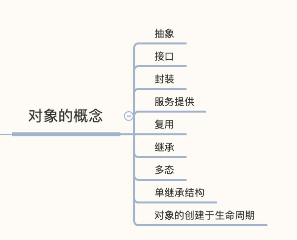

# [对象的概念](https://lingcoder.gitee.io/onjava8/#/book/01-What-is-an-Object)

## 抽象

所有编程语言都提供抽象机制。

面向对象的五大特征:

> 1. 万物皆对象
> 2. 程序是一组对象，通过消息来告知彼此来做什么
> 3. 每个对象都有自己的存储空间，可容纳其他对象
> 4. 每个对象都有一种类型
> 5. 同一类所有对象都能接收相同的消息

## 接口

对象通过定义接口来接收特定的请求。

## 服务提供

在开发或理解程序设计时，我们可以将对象看出是“服务提供者”。

## 封装

访问控制的原因:

> 1. 让应用程序员不要触摸他们不应该触摸的部分
> 2. 使类库的创建者(研发程序员)在不影响后者使用的情况下完善更新工具库。

| 修饰符    | 含义                                                         |
| --------- | ------------------------------------------------------------ |
| public    | 公开, 表示任何人都可以访问和使用该元素                       |
| private   | 私有，除了类本身和类内部的方法，外界无法直接访问该元素。private是类和调用者之间的屏障。任何试图访问私有成员的行为都会报编译时错误 |
| protected | 受保护，类似于private，区别是子类可以访问protected的成员，单不能访问private成员 |
| default   | 默认，如果你不适用前面的三者，默认就是default访问权限。default被称为包访问，因为该权限下的资源可以被同一包（组件库）中其他类的成员访问 |

## 复用

如何复用一个类:

> 1. 组合(Composition) 经常用来表示"拥有"关系(has-a relationship)。例如，“汽车拥有引擎”。
> 2. 聚合(Aggregation) 动态的组合

组合结构比继承结构更简单灵活，而且设计更加清晰。

## 继承

## 多态

发送消息给对象时，如果程序不知道接收的具体类型是什么，但最终执行是正确的，这就是对象的“多态性”（Polymorphism）

> 前期绑定: 编译器生成对特定函数名的调用，该调用会被解析为将执行的代码的绝对地址
>
> 后期绑定: 当向对象发送信息时，被调用的代码直到运行时才确定。编译器确保方法存在，并对参数和返回值执行类型检查，但是它不知道要执行的确切代码。

## 单继承结构

在Java中所有类都继承自Object

单继承的好处:

> 1. 所有对象都具有一个公共接口，因为它们最终都属于同一个基类
> 2. 对于完全面向对象编程，我们必须要构建自己的层次结构，以提供与其他 OOP 语言同样的便利。我们经常会使用到新的类库和不兼容的接口。为了整合它们而花费大气力（有可能还要用上多继承）以获得 C++ 样的“灵活性”值得吗？如果从零开始，Java 这样的替代方案会是更好的选择
> 3. 单继承的结构使得垃圾收集器的实现更为容易
> 4. 由于运行期的类型信息会存在于所有对象中，所以我们永远不会遇到判断不了对象类型的情况。这对于系统级操作尤其重要，例如[异常处理](https://lingcoder.gitee.io/onjava8/#/book/01-What-is-an-Object?id=异常处理)。同时，这也让我们的编程具有更大的灵活性。

## 集合

选择集合的原因:

> 1. 集合可以提供不同类型的接口和外部行为。堆栈、队列的应用场景和集合、列表不同，它们中的一种提供的解决方案可能比其他灵活得多。
> 2. 不同的集合对某些操作有不同的效率。例如，List 的两种基本类型：ArrayList 和 LinkedList。虽然两者具有相同接口和外部行为，但是在某些操作中它们的效率差别很大。在 ArrayList 中随机查找元素是很高效的，而 LinkedList 随机查找效率低下。反之，在 LinkedList 中插入元素的效率要比在 ArrayList 中高。由于底层数据结构的不同，每种集合类型在执行相同的操作时会表现出效率上的差异。

## 对象创建与生命周期

