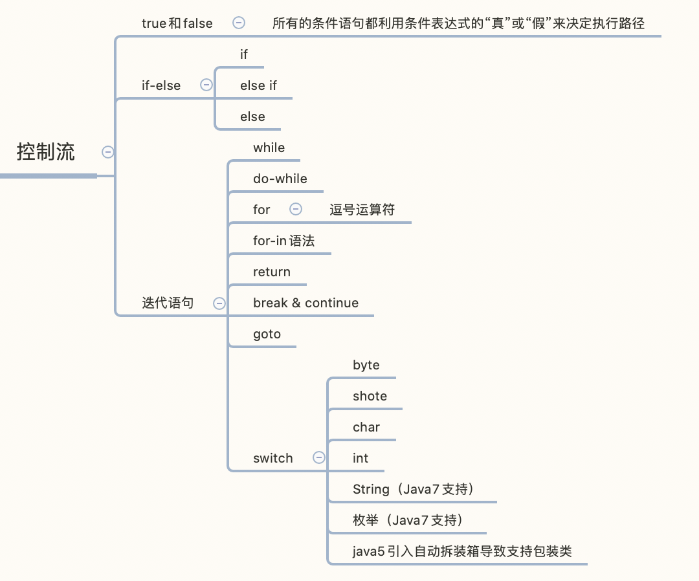

# 控制流



## true和false

所有的条件语句都利用条件表达式的“真”或“假”来决定执行路径。

## if-else

```java
if (Boolean-expression) {
  // statement
} else if (Boolean-expression) {
  // statement
} else {
  // statement
}
```

## 迭代语句

**while**，**do-while** 和 **for** 用来控制循环语句（有时也称迭代语句）。只有控制循环的布尔表达式计算结果为 `false`，循环语句才会停止。

### while

```java
while(Boolean-expression) {
  // Boolean-expression 为true才会执行
  // statement 
}
```

### do-while

```java
do {
  // 这里的语句一定会执行
  // statement
}
```

### for

```java
for (initialization; Boolean-expression; step) {
  // Boolean-expression 为 true才会执行
  // statement
}

// 死循环
for (;;) {
  
}
```

### 逗号运算符

在 Java 中逗号运算符（这里并非指我们平常用于分隔定义和方法参数的逗号分隔符）仅有一种用法：在 **for** 循环的初始化和步进控制中定义多个变量。我们可以使用逗号分隔多个语句，并按顺序计算这些语句。**注意**：要求定义的变量类型相同。

在 Java 中，仅允许 **for** 循环在控制表达式中定义变量

无论在初始化还是在步进部分，语句都是顺序执行的。

## for-in 语法

Java 5 引入了更为简洁的“增强版 **for** 循环”语法来操纵数组和集合.

**for-in** 循环适用于任何可迭代（*iterable*）的 对象

```java
for (x : [List|Array]) {
  
}
```

## return

1.指定一个方法返回值 (在方法返回类型非 **void** 的情况下)；

2.退出当前方法，并返回作用 1 中值。

## break 和 continue

## goto

```java
label1:
outer-iteration {
	inner-iteration {
    break;
    continue;
    continue label1;
    break label1;
  }
}
```

## switch

```java
swich(integral-selector) {
  case integral-value1:
  	statement;
  	break;
  case integral-value2:
  	statement;
  	break;
  //...
  default:
  	statement;
}
```

> switch能接受的类型: byte/short/char/int(java5之后引入自动拆装箱导致可以接受包装类型)
>
> java7新增 枚举和String