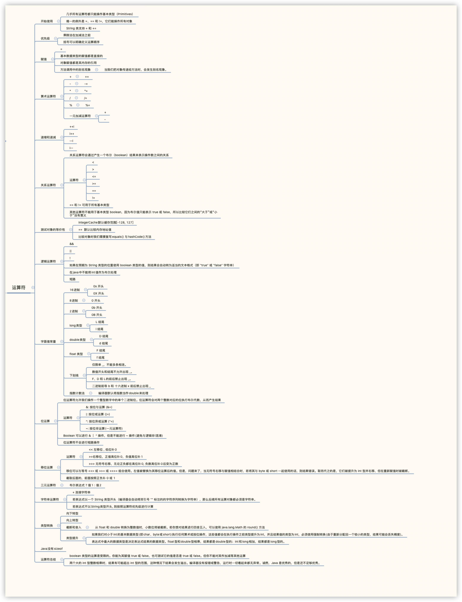

# 运算符




## 开始使用

> 1. 几乎所有运算符都只能操作基本类型(Primitives)。
> 2. =、==、!= 可以操作所有对象
> 3. String 类支持 + 和 +=

## 优先级

> 1. 乘法和除法在加法和减法之前
> 2. 可以使用括号明确规定运算顺序

## 赋值

> 1. 运算符的赋值是由符号 `=` 完成的。它代表着获取 `=` 右边的值并赋给左边的变量
> 2. 基本类型的赋值都是直接的
> 3. 对象的赋值是其内存的引用

## 方法调用中的别名现象

当我们把对象传递给方法时，会发生别名现象。

## 算术运算符

Java的基本运算符与其他大多编程语言时相同的。其中包括加号 `+`、减号 `-`、除号 `/`、乘号 `*` 以及取模 `%`（从整数除法中获得余数）。整数除法会直接砍掉小数，而不是进位。

Java 也用一种与 C++ 相同的简写形式同时进行运算和赋值操作，由运算符后跟等号表示，并且与语言中的所有运算符一致（只要有意义）。 可用 x += 4 来表示：将 x 的值加上4的结果再赋值给 x。

###一元加减运算符

一元减号可以得到数据的负值。一元加好的作用相反，不过它唯一能影响的就是把较小的数值类型自动转换为int类型。

```java
        char i = 1;
        char j = 2;
        // 一元运算符会把较小的数值类型自动转换为 int 类型
//        char k = -i + j; Required char, Found int
```

## 递增和递减

> ++i
>
> i++
>
> --i
>
> i--

## 关系运算符

关系运算符会通过产生一个布尔(boolean)结果来表示操作数之间的关系。如果关系为真，则结果为true，如果关系为假，则结果为false。关系运算符包括小于 `<`，大于 `>`，小于或等于 `<=`，大于或等于 `>=`，等于 `==` 和不等于 `！=`。`==` 和 `!=` 可用于所有基本类型，但其他运算符不能用于基本类型 **boolean**，因为布尔值只能表示 **true** 或 **false**，所以比较它们之间的“大于”或“小于”没有意义。

### 测试对象的等价性

1. IntegerCache默认缓存范围[-128, 127]

2. ==  默认比较内存地址值
3. 比较对象时我们需要复写equals() 与hashCode()方法

```java
/**
 * Equals
 *
 * @author liko
 * @date 2020/4/15
 */
public class Equals {
    public static void main(String[] args) {
        User liko = new User(27);
        User youyou = new User(27);

        System.out.println(liko == youyou); // false
        System.out.println(liko.equals(youyou)); // true
    }
}

@Data
@AllArgsConstructor
@EqualsAndHashCode
class User {
    int age;
}
```

## 逻辑运算符

每个逻辑运算符 `&&`(AND)、`||`(OR)、`!`(非)根据参数的逻辑关系生成布尔值`true`或`false`。

如果在预期为 **String** 类型的位置使用 **boolean** 类型的值，则结果会自动转为适当的文本格式（即 "true" 或 "false" 字符串）

在java中不能将int值作为布尔处理

###短路

逻辑运算符支持一种称为“短路”（short-circuiting）的现象。整个表达式会在运算到可以明确结果时就停止并返回结果，这意味着该逻辑表达式的后半部分不会被执行到。

## 字面值常量

通常，当我们向程序中插入一个字面值常量（**Literal**）时，编译器会确切地识别它的类型。当类型不明确时，必须辅以字面值常量关联来帮助编译器识别。

| 示例                  | 备注                                                   |
| --------------------- | ------------------------------------------------------ |
| 0x2f                  | `0x`开头表示16进制 (小写)                              |
| 0X2F                  | `0X`开头表示16进制 (大写)                              |
| 0177                  | `0`开头表示8进制                                       |
| 100L/100l             | `L` `l` 结尾表示Long类型                               |
| 0b00010011/0B00010101 | `0b` `0B`开头表是2进制字面常量(可以初始化所有整数类型) |
| 100F/100f             | `F` `f`结尾表示float类型                               |
| 100D/100d             | `d` `D`结尾表示Double类型                              |

### 下划线

Java 7 中有一个深思熟虑的补充：我们可以在数字字面量中包含下划线 `_`，以使结果更清晰。这对于大数值的分组特别有用。

```java
int i = 123_123_123;
```

> 1. 仅限单 `_`，不能多条相连。
> 2. 数值开头和结尾不允许出现 `_`。
> 3. `F`、`D` 和 `L`的前后禁止出现 `_`。
> 4. 二进制前导 `b` 和 十六进制 `x` 前后禁止出现 `_`。

Unix换行符`\n`, Windows换行符`\r\n`, Java 用 `%n` 实现的可以忽略平台间差异而生成适当的换行符，但只有当你使用 `System.out.printf()` 或 `System.out.format()` 时。对于 `System.out.println()`，我们仍然必须使用 `\n`；如果你使用 `%n`，`println()` 只会输出 `%n` 而不是换行符。

### 指数计数法

```java
public class Exponents {
    public static void main(String[] args) {
        // 大写 E 和小写 e 的效果相同:
        float expFloat = 1.39e-43f;
        expFloat = 1.39E-43f;
        System.out.println(expFloat);
        double expDouble = 47e47d; // 'd' 是可选的
        double expDouble2 = 47e47; // 自动转换为 double
        System.out.println(expDouble);
    }
}
```

编译器通常会将指数作为 **double** 类型来处理，所以假若没有这个后缀字符 `f`，编译器就会报错，提示我们应该将 **double** 型转换成 **float** 型。

## 位运算符

位运算符允许我们操作一个整型数字中的单个二进制位。位运算符会对两个整数对应的位执行布尔代数，从而产生结果。

> &: 按位与运算 (&=)
>
> |: 按位或运算 (|=)
>
> ^: 按位异或运算 (^=)
>
> ~: 按位非运算(一元运算符)

Boolean 可以进行 & ｜ ^ 操作，但是不能进行 ~ 操作(避免与逻辑非`!`混淆)

位运算符不会进行短路操作

## 移位运算符

```java
// 计算机对有符号数(包括浮点数)的表示有三种方法: 原码、反码和补码
// 补码 = 反码 + 1
// 在二进制中，最高位为0表示正数，最高位为1表示负数
// 正数用原码表示
// 负数用补码表示

int m = 5;
// 00000000000000000000000000000101
System.out.println(String.format("%032d", Integer.parseInt(Integer.toBinaryString(m))));
int n = -5;
// 11111111111111111111111111111011
System.out.println(Integer.toBinaryString(n));

/*
  ~00000000000000000000000000000101 ==> +5 原码
 ----------------------------------
   11111111111111111111111111111010 ==> 反码
  +                               1
 ----------------------------------
   11111111111111111111111111111011 ==> -5 补码
*/

```

> << 左移位 , 低位补0
>
> \>\>右移位，正值高位补0，负值高位补1
>
> \>\>\> 无符号右移，无论正负都在高位补0, 负数高位补0后变为正数

> 移位可以与等号 `<<=` 或 `>>=` 或 `>>>=` 组合使用。左值被替换为其移位运算后的值。但是，问题来了，当无符号右移与赋值相结合时，若将其与 **byte** 或 **short** 一起使用的话，则结果错误。取而代之的是，它们被提升为 **int** 型并右移，但在重新赋值时被截断。
>
> **截取后面的，前面按照正负补 0 或 1**

## 三元运算符

> 布尔表达式 ? 值1 : 值2

## 字符串运算符

> \+ 连接字符串
>
> 若表达式以一个 **String** 类型开头（编译器会自动将双引号 `""` 标注的的字符序列转换为字符串），那么后续所有运算对象都必须是字符串。
>
> 若表达式不以**String**类型开头, 则按照运算符优先级进行计算

## 类型转换

“类型转换”（Casting）的作用是“与一个模型匹配”。在适当的时候，Java 会将一种数据类型自动转换成另一种。例如，假设我们为 **float** 变量赋值一个整数值，计算机会将 **int** 自动转换成 **float**。我们可以在程序未自动转换时显式、强制地使此类型发生转换。

要执行强制转换，需要将所需的数据类型放在任何值左侧的括号内

若将数据类型进行“向下转换”（**Narrowing Conversion**）的操作（将容量较大的数据类型转换成容量较小的类型），可能会发生信息丢失的危险。此时，编译器会强迫我们进行转型，好比在提醒我们：该操作可能危险，若你坚持让我这么做，那么对不起，请明确需要转换的类型。 对于“向上转换”（**Widening conversion**），则不必进行显式的类型转换，因为较大类型的数据肯定能容纳较小类型的数据，不会造成任何信息的丢失。

## 截断和舍入

从 **float** 和 **double** 转换为整数值时，小数位将被截断。若你想对结果进行四舍五入，可以使用 `java.lang.Math` 的 `round()` 方法

### 类型提升

如果我们对小于int的基本数据类型(即**char**、**byte**或**short**)执行任何算术或按位操作，这些值都会在执行操作之前类型提升为int，并且结果值的类型为int，必须使用强制转换(由于重新分配回一个较小的类型，结果可能会丢失精度)。通常，表达式中最大的数据类型是决定表达式结果的数据类型。**float**型和**double**型相乘，结果都是double型的；int和long相加，结果都是long型的。

## Java没有sizeof

## 运算符总结

1. **boolean** 类型的运算是受限的。你能为其赋值 `true` 或 `false`，也可测试它的值是否是 `true` 或 `false`。但你不能对其作加减等其他运算
2. 两个大的 int 型整数相乘时，结果有可能超出 **int** 型的范围，这种情况下结果会发生溢出。编译器没有报错或警告，运行时一切看起来都无异常。诚然，Java 是优秀的，但是还不足够优秀。